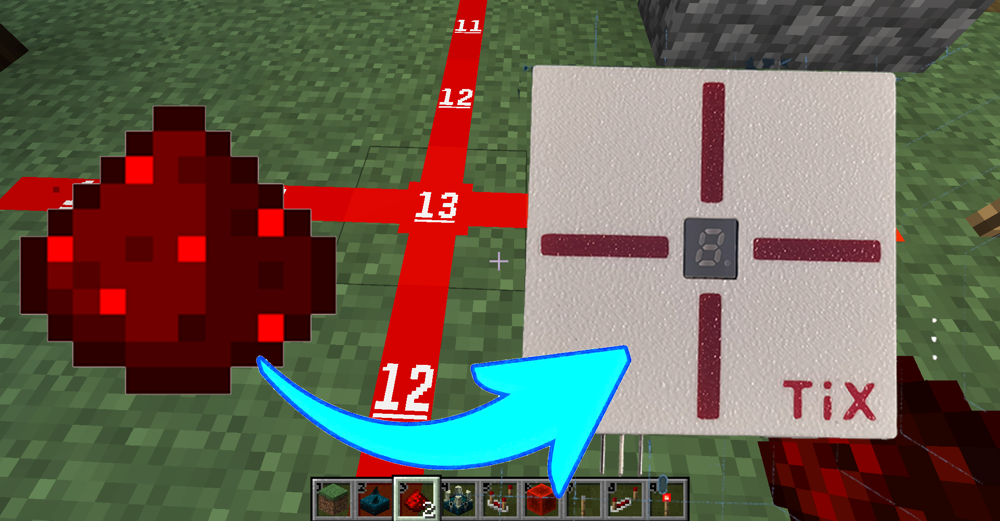
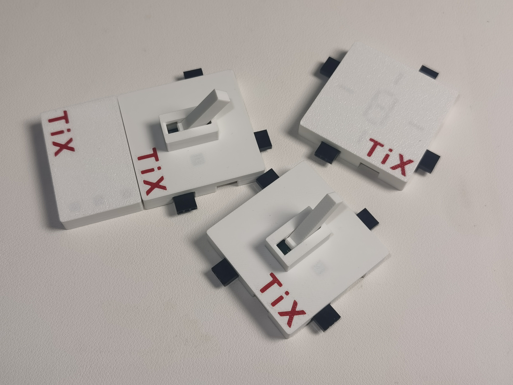
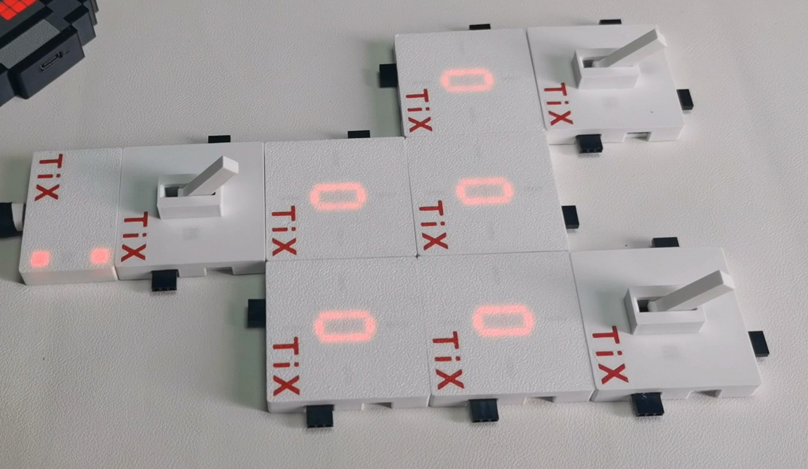
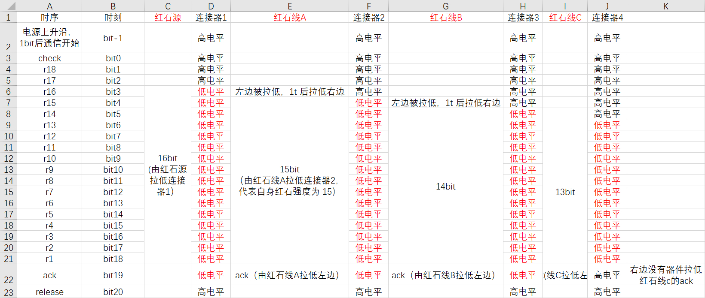

# 我的世界红石

**目录：**

- [我的世界红石](#我的世界红石)
  - [一、项目介绍](#一项目介绍)
  - [二、数字红石通信协议](#二数字红石通信协议)
    - [1、物理连接](#1物理连接)
    - [2、协议特性](#2协议特性)
    - [3、协议原理](#3协议原理)
  - [三、仓库介绍](#三仓库介绍)
    - [1、repo 介绍](#1repo-介绍)
    - [2、本项目使用方法](#2本项目使用方法)
    - [3、不想使用 repo？](#3不想使用-repo)

## 一、项目介绍

这是一个尝试在现实中实现红石的小项目，因为一些缺陷，将放弃模拟方案，转为数字方案





效果演示视频：

* 模拟方案：[【Bilibili】红石中继器进度报告](https://www.bilibili.com/video/BV1awhPzsEa1)
* 数字方案：[【Bilibili】如何在现实中实现我的世界红石？](https://www.bilibili.com/video/BV1s3H9zcEhD)

硬件开源地址：[【Oshwhub】@realTiX - 我的世界红石_数字方案](https://oshwhub.com/realtix/minecraft_redstone_digital)

## 二、数字红石通信协议

### 1、物理连接

仅需三根线即可完成通信  

* 电源线：输入 5~12V，同时承载同步时钟功能
* 通信线：3.3V 弱上拉，通信时先拉低者红石信号更强
* 公共地

### 2、协议特性

* 仅需一次通信就能完成所有红石元器件的信号强度计算
* 不会出现类似 java 版中的红石粉大量递归情况
* 接口占用少，包含电源线仅需三根线
* 外设占用小，不需要串口之类的外设，每个方向只需要一个弱上拉的 gpio 即可
* 系统运行资源占用小，只需每个毫秒读写一次引脚电平即可

### 3、协议原理

**信号同步原理：**  
将供电器连接到线路中的任意部分后，它会每两个游戏刻（100ms）关闭电源输出 1ms，各个红石元器件上因为电容的存在，并不会因为电源关闭 1ms 而关机，它们会在检测到电源线上升沿后开始进行数据准备，1ms 后所有设备正式开始通信

**红石强度比较原理：**  
整个通信帧有如下 20 个 bit：

* bit0：check 位，此位必为高电平，否则视为该线路损坏
* bit1：预留位 1
* bit2：预留位 2
* bit3 ~ bit18：强度位，自身红石强度为 n，则会拉低后 n 个 bit
* bit19：ack 位，如果某个方向先拉低了强度位，会拉低该方向的 ack 位以告知对方

一个 bit 占 2ms，偶毫秒用来写引脚，奇毫秒用来读引脚，所以一次通信为 40 ms，在一个游戏刻（50ms）以内

强度位拉低后 n 个 bit 为本协议的核心，强度越强的会越先拉低，从而无痛实现强度比较

**时序样例：**  


> 表中所有红石元件之间的通信都是同时进行的，并非 a 传完 20 bit 给 b 后 b 再传 20 bit 给 c

## 三、仓库介绍

本仓库使用 repo 管理，以便管理多种红石器件

### 1、repo 介绍

[【CSDN】repo 简单搭建学习记录](https://blog.csdn.net/realTiX/article/details/142501192)  
[【CSDN】windows 下 repo 安装](https://blog.csdn.net/weixin_42107504/article/details/140709590)

### 2、本项目使用方法

**repo 初始化**  

```shell
repo init -u https://gitee.com/TiX233/minecraft_redstone_repo -b master -m digital_gitee.xml
```

**repo 同步**  

```shell
repo sync
```

### 3、不想使用 repo？

那么打开对应的 xml 文件，从中手动克隆所需红石元件即可
